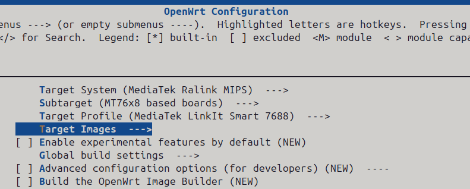
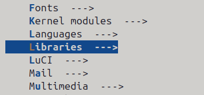
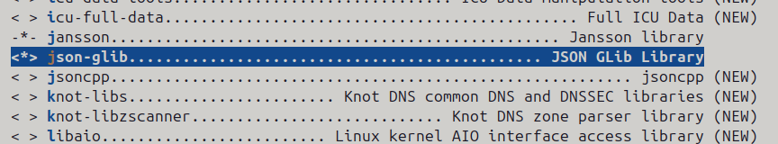
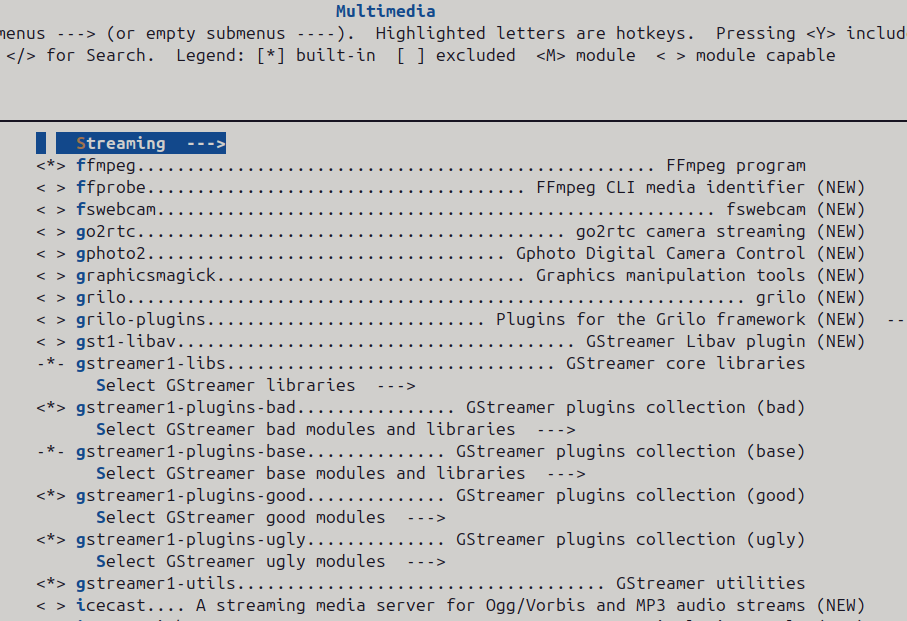
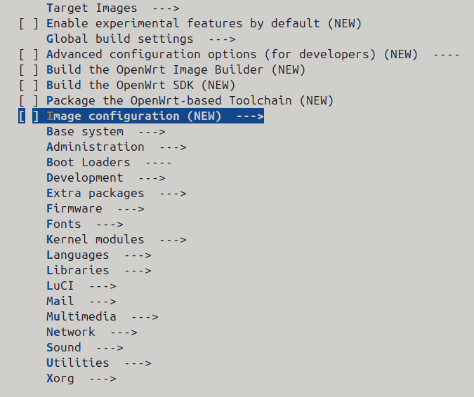

# Hướng dẫn cài đặt Openwrt phiên bản 24.10
- Ngày viết: 10/02/2025
### Tải source dự án
```cmd
git clone https://github.com/openwrt/openwrt.git
cd openwrt
```

### Chuyển sang nhánh phiên bản 24.10 + Cập nhật package + Cài đặt các package
```cmd
git checkout openwrt-24.10
./scripts/feeds update -a # Cập nhật package
./scripts/feeds install -a # Cài đặt package
```

### Cấu hình Openwrt cho target
- Hiện tại tôi đang dùng thiết bị Iot sủ dụng chip MT7688 của Mediatek nếu bạn sử dụng chip khác thì hãy cấu hình target phù hợp  



#### Thêm thư viện json-glib
- Libraries --->  json-glib  

  



- Thư viện json-glib là gói cần thiết cho để biên dịch [simple-whip-client](https://github.com/meetecho/simple-whip-client) và [simple-whep-client](https://github.com/meetecho/simple-whep-client)
Ngoài thư viện đó ra còn libsoup (~= 2.4) đã được Openwrt cấu hình sẵn, thư viện GStreamer (>= 1.16) được sẽ được [cấu hình cài bên dưới](#thêm-package-gstreamer-và-ffmpeg-phục-vụ-stream-media), pkg-config sẽ hoàn thiện [tại đây]()

 

### Thêm package gstreamer và ffmpeg phục vụ stream media
- Bạn hãy tích hết vào phần ffmpeg, gstreamer theo trong ảnh  

  

### Chú ý
- Bạn có thể cài các package, thư viện khác để cài mặc định cùng hệ điều hành và các cấu hình khác  

### Cài đặt tất cả và hoàn thành
```cmd
make -j$(( $(nproc) - 1 ))
```
- Quá trình xây dụng Openwrt có thể mất 3 - 5 tiếng tùy cấu hình máy và dung lượng sẽ chiếm gần 40GB nên bạn hãy chuẩn bị trước dung lượng ổ cứng